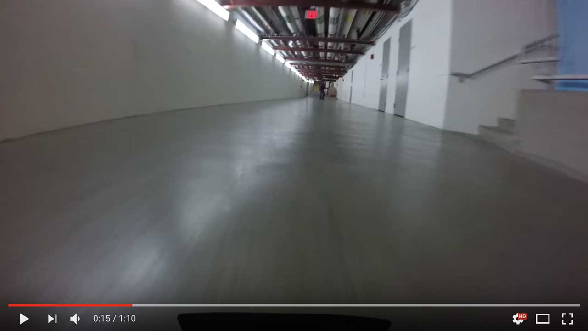

# Pure Pursuit + A* Trajectory Planning

This code implements both Pure Pursuit trajectory tracking, and trajectory planning with 2-level A* search.

[](https://www.youtube.com/watch?v=pBX_JONXpN8?t=12s)

This video uses similar code, but it is extended to include variable speed trajectories:
[https://www.youtube.com/watch?v=9fzzp6oxid4](https://www.youtube.com/watch?v=9fzzp6oxid4)

## Installation

You will need the map_server, recordclass, and scikit-image.

```
pip install recordclass
# this one will take a while
pip install scikit-image
```

Run the following in the root of the workspace containing this module:

```
sudo apt-get update
rosdep install -r --from-paths src --ignore-src --rosdistro kinetic -y
```

## Usage

**NOTICE**: There is no safety controller here yet. It is on the list of TODOs for us. Be very careful when running this code to avoid crashes.

### Pure Pursuit only 

You have to run teleoperation, localization, and pure pursuit trajectory following nodes.

```
# For the car
roslaunch racecar teleop.launch
roslaunch ta_lab5 localize.launch
roslaunch ta_lab6 follow_trajectory.launch

# For simulation
roslaunch racecar_gazebo racecar_tunnel.launch
roslaunch ta_lab6 follow_trajectory.launch
```

Once those are running, you can use the trajectory loader node to initialize pure pursuit with a trajectory.

```
roslaunch ta_lab6 trajectory_loader.launch
```

### Pure Pursuit + Path planning: Waypoint based control

You have to run teleoperation, localization, pure pursuit trajectory following, and path planning nodes.

```
# For the car
roslaunch racecar teleop.launch
roslaunch ta_lab5 localize.launch
roslaunch ta_lab6 follow_trajectory.launch
roslaunch ta_lab6 waypoint_control.launch

# For simulation
roslaunch racecar_gazebo racecar_tunnel.launch
roslaunch ta_lab6 follow_trajectory.launch
roslaunch ta_lab6 waypoint_control.launch
```

Once the nodes are running, you should initialize the particle filter with the 2D Pose Estimate RViz function. Then, you can specify a goal point with the 2D Nav Goal function. First it will plan a rough trajectory, then refine that trajectory, and then attempt to follow the trajectory.

## Organization

### [./launch](./launch)

Contains all the necessary launch files to run the code.

[**./launch/waypoint_control.launch**](./launch/waypoint_control.launch)

Launches trajectory search. Uses the car position (given by odometry/particle filter) as a start point, and listens for "2D Nav Goal" points from RViz as goal points. 

[**./launch/follow_trajectory.launch**](./launch/follow_trajectory.launch)

This launches pure pursuit. Will not start driving until a trajectory is received, either from the waypoint_control search, or from the load_trajectory node.

[**./launch/build_trajectory.launch**](./launch/build_trajectory.launch)

Allows manual trajectory generation. Run this launch file and then in RViz use the "2D Nav Goal" feature to specify path waypoints. Add the /built_trajectory/path topic to see the path as it is built. When you terminate the node, it will save the trajectory to the file system and tell you the file path.

[**./launch/load_trajectory.launch**](./launch/load_trajectory.launch)

Loads trajectories from the file system and publishes them in the serialized polygon format. Use this to initialize the pure pursuit with custom trajectories once the "follow_trajectory" node is already running. 

### [./src](./src)

Contains all the source code for this node.

[**./src/path_planner.py**](./src/path_planner.py)

Implements two-level A* search. The first level finds a rough trajectory, and the second level uses the initial trajectory as a heuristic to find a smoother and shorter path.

[**./src/pure_pursuit.py**](./src/pure_pursuit.py)

Implements Pure Pursuit trajectory tracking. Fixed speed, fixed lookahead.

[**./src/trajectory_builder.py**](./src/trajectory_builder.py)

Listens for 2D Nav Goals from RViz and generates piecewise linear trajectories. Saves the result to the file system when the node is shut down.

[**./src/trajectory_loader.py**](./src/trajectory_loader.py)

Loads trajectories from the file system and publishes them in serialized polygon format.

### [./trajectories](./trajectories)

Contains a few example trajectories, generated with either manual specification or waypoint control. loop2.traj is a good manually defined trajectory for going around the basement.

### [./rviz](./rviz)

Contains a few RViz config files for visualizing interesting topics during search or pure pursuit.

